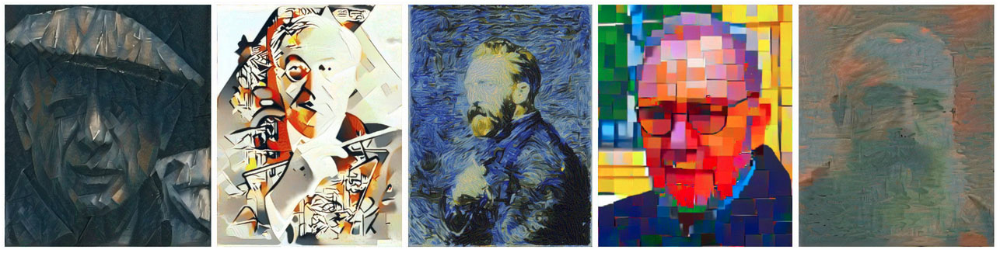

## In the light of feature distributions: Moment matching for Neural Style Transfer (CVPR 2021)

This repository provides code to recreate results presented in [In the light of feature distributions: Moment matching for Neural Style Transfer](https://arxiv.org/abs/2103.07208).

For more information, please see the [project website](https://cmdnst.github.io/) and make sure to check out our medium blog post [here](https://medium.com/ecovisioneth/6e5300a5c57b?source=friends_link&sk=63dc9a371ab365f01268d31a6dce742d)

<hr />


### Contact
If you have any questions, please let me <a href='m&#97;i&#108;to&#58;niko&#37;6Ca&#105;%2&#69;%6Ba&#37;&#54;&#67;i&#37;7&#51;c&#37;68&#101;k&#64;ge&#37;&#54;Fd&#46;bau%67&#46;&#101;&#116;h%7A&#46;%6&#51;&#104;'>know</a>

### Instructions
Running neural style transfer with Central Moment Discrepancy is as easy as running 
```shell
python main.py --c_img ./path/to/content.jpg --s_img ./path/to/style.jpg
``` 
You have the following command line arguments to change to your needs:
<pre>
  --c_img         The content image that is being stylized.
  --s_img         The style image
  --epsilon       Iterative optimization is stopped if delta value of 
                  moving average loss is smaller than this value.
  --max_iter      Maximum iterations if epsilon is not surpassed
  --alpha         Convex interpolation of style and content loss 
                  (should be set high > 0.9 since we start with content as target)
  --lr            Learning rate of Adam optimizer
  --im_size       Output image size. Can either be single integer for keeping aspect ratio or tuple.
</pre>

### Citations
```
@article{kalischek2021light,
      title={In the light of feature distributions: moment matching for Neural Style Transfer}, 
      author={Nikolai Kalischek and Jan Dirk Wegner and Konrad Schindler},
      year={2021},
      eprint={2103.07208},
      archivePrefix={arXiv},
      primaryClass={cs.CV}
}
```
